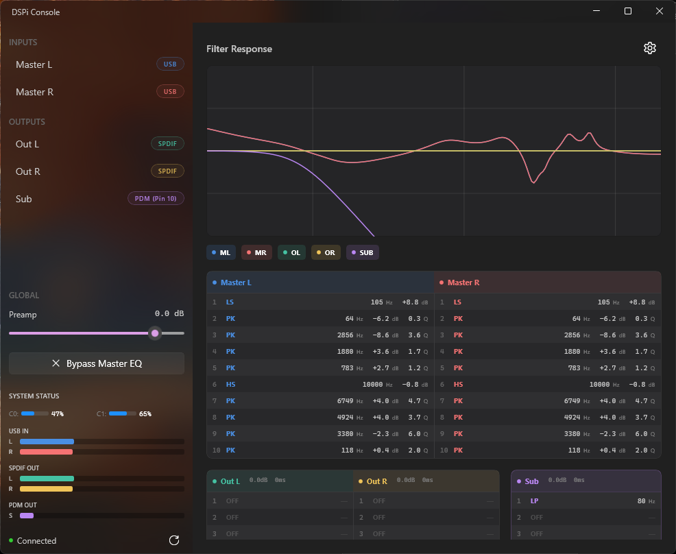

# DSPi Console for Windows

A WinUI 3 control application for the DSPi audio processor. Supports both RP2040 and RP2350 platforms.



## Features

### Parametric EQ
- 10-band parametric EQ per channel with real-time biquad coefficient updates
- Filter types: Peaking, Low Shelf, High Shelf, Low Pass, High Pass
- Live Bode plot with hardware-accelerated rendering (Win2D)
- Global preamp gain (-60 to +10 dB) and master EQ bypass

### Platform Support
- **RP2040**: 2 inputs (Master L/R) + 5 outputs (SPDIF 1 L/R, SPDIF 2 L/R, PDM)
- **RP2350**: 2 inputs (Master L/R) + 9 outputs (SPDIF 1-4 L/R, PDM)
- Auto-detection of connected platform with appropriate channel display

### Matrix Mixer
- Full routing matrix: 2 inputs x N outputs with per-route gain, invert, and enable
- Per-output gain, delay, mute, and enable controls
- Editable channel names
- All numeric values support scroll wheel, keyboard entry, and right-click reset
- PDM/SPDIF safety interlock - warns when enabling mutually exclusive outputs on the shared Core 1 resource
- Disabled output columns are dimmed and non-interactive

### Per-Channel Controls
- Delay: 0-170 ms per output channel
- Gain: -60 to +12 dB per output channel
- Mute: independent per output

### Loudness Compensation
- ISO 226 equal-loudness contour correction
- Adjustable reference SPL (40-100 dB) and intensity (0-200%)
- Real-time compensation curve visualization

### Headphone Crossfeed
- BS2B binaural processing for natural headphone imaging
- 3 presets: Default (700 Hz / 4.5 dB), Chu Moy (700 Hz / 6.0 dB), Jan Meier (650 Hz / 9.5 dB)
- Custom mode with manual cutoff frequency and feed level
- Optional interaural time delay (~220 us)

### AutoEQ Integration
- Search and apply profiles from the AutoEQ database (1000+ headphone models)
- Favorites system for quick access
- Automatic preamp adjustment

### Filter Import/Export
- Import from DSPi Console multi-channel format or Room EQ Wizard (REW) format
- Export only includes channels with active filters
- Channel selection dialog with all outputs shown; enabled channels pre-checked for DSPi format

### Hardware Configuration
- GPIO pin reassignment for each output (via Settings > Hardware)
- Duplicate pin detection and conflict warnings

### Parameter Persistence
- Commit to device flash (survives power cycles)
- Revert to last saved state
- Factory reset

### Real-time Monitoring
- Peak meters for all channels
- CPU load display for both cores
- System stats: clock frequency, supply voltage, sample rate, temperature, PDM/SPDIF error counters
- Device serial, platform, and firmware version

### Dashboard
- Overview of all channels with filter summaries
- Live gain, delay, and mute status in channel headers
- Color-coded channels with visibility toggles on the Bode plot

## Requirements

- Windows 10 version 1809 (build 17763) or later
- .NET 8 SDK
- Visual Studio 2022 with:
  - .NET Desktop Development
  - Windows App SDK (C#)

## Building

```bash
dotnet build -p:Platform=x64
```

Or open `DSPiConsole.sln` in Visual Studio 2022 and build with Ctrl+Shift+B.

## Usage

1. Connect your DSPi device via USB
2. Launch DSPi Console - it will automatically detect and connect
3. Select a channel from the sidebar to edit its filters
4. Click a channel again to return to the dashboard

### Keyboard Shortcuts

| Shortcut | Action |
|----------|--------|
| Ctrl+I | Import Filters |
| Ctrl+E | Export Filters |
| Ctrl+S | Commit Parameters |
| Ctrl+Shift+B | Browse AutoEQ Profiles |
| Ctrl+Shift+L | Loudness Compensation |
| Ctrl+Shift+C | Crossfeed |
| Ctrl+Shift+M | Matrix Mixer |
| Ctrl+Shift+T | System Stats |
| Alt+F4 | Exit |

## Project Structure

```
DSPiConsole-Windows/
├── DSPiConsole/                     # WinUI 3 application
│   ├── App.xaml(.cs)                # Entry point and theme resources
│   ├── MainWindow.xaml(.cs)         # Main window, dashboard, channel editor
│   ├── MatrixMixerWindow.xaml(.cs)  # Matrix mixer routing window
│   ├── LoudnessWindow.xaml(.cs)     # Loudness compensation
│   ├── CrossfeedWindow.xaml(.cs)    # BS2B crossfeed
│   ├── StatsWindow.xaml(.cs)        # System statistics
│   ├── SettingsDialog.xaml(.cs)     # Settings and pin assignment
│   ├── Controls/
│   │   ├── BodePlotControl.cs       # Win2D frequency response graph
│   │   ├── HorizontalMeterBar.cs    # Peak level meters
│   │   └── CpuMeter.cs             # CPU load display
│   ├── Dialogs/
│   │   ├── AutoEQBrowserDialog      # Headphone profile browser
│   │   └── ChannelSelectionDialog   # Import channel picker
│   ├── Services/
│   │   ├── AutoEQManager.cs         # AutoEQ database and favorites
│   │   └── FilterFileService.cs     # Filter file parsing
│   └── ViewModels/
│       ├── MainViewModel.cs         # Application state and USB commands
│       └── StatsViewModel.cs        # Stats window state
├── DSPiConsole.Core/                # Core library
│   ├── Models/
│   │   ├── Channel.cs               # Channel definitions
│   │   ├── FilterParams.cs          # Filter types and parameters
│   │   ├── LoudnessData.cs          # ISO 226 loudness curves
│   │   ├── CrossfeedData.cs         # BS2B crossfeed math
│   │   └── SystemStatus.cs          # Device status model
│   └── DspMath.cs                   # Biquad coefficient calculation
└── DSPiConsole.Usb/                 # USB communication
    └── DspDevice.cs                 # LibUsbDotNet device handling
```

## License

GNU General Public License v3.0

## Acknowledgments

- AutoEQ database from [jaakkopasanen/AutoEq](https://github.com/jaakkopasanen/AutoEq)
